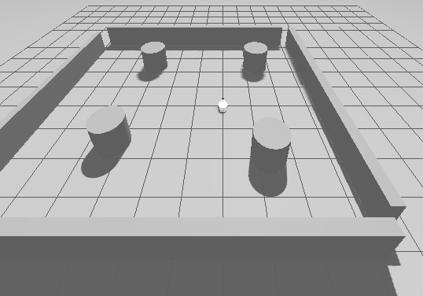
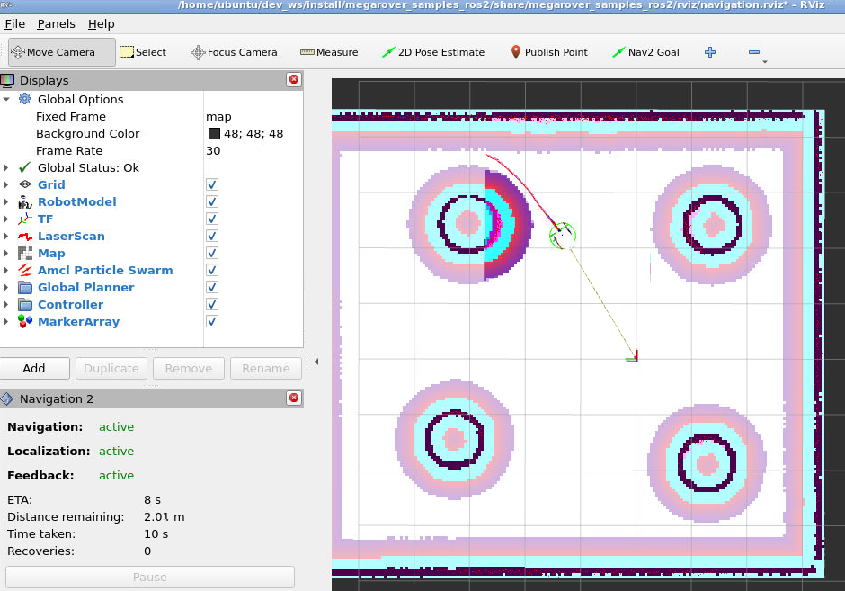

# megarover_samples_ros2

## Introduction

This is a ROS 2 Package to develop package of megarover using Gazebo.
I used model, mesh and world files of <https://github.com/vstoneofficial/megarover_samples> as a reference.

If you use ROS 2 Humble, please check [humble](https://github.com/atinfinity/megarover_samples_ros2/tree/humble) branch.

## Requirements

- ROS 2 Jazzy
- Gazebo Harmonic

And, I have tested with [eProsima Fast DDS](https://github.com/eProsima/Fast-DDS) as RMW implementation.

## Build

```bash
mkdir -p ~/dev_ws/src
cd ~/dev_ws/src
git clone https://github.com/atinfinity/megarover_samples_ros2.git -b jazzy
cd ..
rosdep install -y -i --from-paths src/megarover_samples_ros2
colcon build --symlink-install
source ~/dev_ws/install/setup.bash
```

## Mapping

### Launch Gazebo

If you use headless mode, add the option `gui:=false`.

```bash
ros2 launch megarover_samples_ros2 vmegarover_with_sample_world.launch.py
```



> [!NOTE]
> If you want to do activation with gazebo_ros2_control, add the option `use_ros2_control:=true`.

```bash
ros2 launch megarover_samples_ros2 vmegarover_with_sample_world.launch.py use_ros2_control:=true
```

### Launch Slam Toolbox for Mapping

```bash
ros2 launch megarover_samples_ros2 vmegarover_mapping.launch.py
```

### Launch Teleop

```bash
ros2 run teleop_twist_keyboard teleop_twist_keyboard
```

If you set `use_ros2_control:=true` in `vmegarover_with_sample_world.launch.py`, please run the following commmand(<https://github.com/ros-controls/ros2_controllers/pull/812>).

```bash
ros2 run teleop_twist_keyboard teleop_twist_keyboard --ros-args -p stamped:=true -r /cmd_vel:=/diff_drive_controller/cmd_vel
```

### Save Map

```bash
mkdir ~/maps
ros2 launch megarover_samples_ros2 vmegarover_save_map.launch.py
```

## Navigation

### Launch Gazebo

If you use headless mode, add the option `gui:=false`.

```bash
ros2 launch megarover_samples_ros2 vmegarover_with_sample_world.launch.py
```

> [!NOTE]
> If you want to do activation with gazebo_ros2_control, add the option `use_ros2_control:=true`.

```bash
ros2 launch megarover_samples_ros2 vmegarover_with_sample_world.launch.py use_ros2_control:=true
```

### Launch Navigation

```bash
ros2 launch megarover_samples_ros2 vmegarover_navigation.launch.py map:=$HOME/maps/vmegarover_samplemap.yaml
```

If you set `use_ros2_control:=true` in `vmegarover_with_sample_world.launch.py`, please run the following commmand(<https://github.com/ros-controls/ros2_controllers/pull/812>).

```bash
ros2 launch megarover_samples_ros2 vmegarover_navigation.launch.py use_ros2_control:=true map:=$HOME/maps/vmegarover_samplemap.yaml
```



## ToDo

- [x] 2D Scan
- [x] RGBD Camera
- [x] odometry
- [x] teleop
- [x] slam_toolbox
- [x] amcl
- [x] navigation
