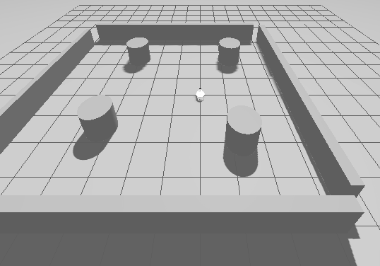

# megarover_samples_ros2

## Introduction

This is a ROS2 Package to develop package of megarover using Gazebo.  
I used model, mesh and world files of <https://github.com/vstoneofficial/megarover_samples> as a reference.

If you use ROS2 Galactic, please check [galactic](https://github.com/atinfinity/megarover_samples_ros2/tree/galactic) branch.

## Requirements

- ROS2 Humble

And, I have tested with [eProsima Fast DDS](https://www.eprosima.com/index.php/products-all/eprosima-fast-dds) as RMW implementation.

## Build

```
$ mkdir -p ~/dev_ws/src
$ cd ~/dev_ws/src
$ git clone https://github.com/atinfinity/megarover_samples_ros2.git
$ cd ..
$ rosdep install -y -i --from-paths src/megarover_samples_ros2
$ colcon build --symlink-install
$ source ~/dev_ws/install/setup.bash
```

## Mapping

### Launch Gazebo

If you use headless mode, add the option `gui:=false`.

```
$ ros2 launch megarover_samples_ros2 vmegarover_with_sample_world.launch.py
```



NOTE (humble only):

In **humble**, gazebo_ros2_control can be activated. If you want to do activation with gazebo_ros2_control, add the option `use_ros2_control:=true`

However, at this time, **gazebo_ros2_control is still under development and unstable**.

```
$ ros2 launch megarover_samples_ros2 vmegarover_with_sample_world.launch.py use_ros2_control:=true
```

### Launch Slam Toolbox for Mapping

```
$ ros2 launch megarover_samples_ros2 vmegarover_mapping.launch.py
```

### Launch Teleop

```
$ ros2 run teleop_twist_keyboard teleop_twist_keyboard
```

### Save Map

```
$ mkdir ~/maps
$ ros2 launch megarover_samples_ros2 vmegarover_save_map.launch.py
```

## Navigation

### Launch Gazebo

If you use headless mode, add the option `gui:=false`.

```
$ ros2 launch megarover_samples_ros2 vmegarover_with_sample_world.launch.py
```

### Launch Navigation

```
$ ros2 launch megarover_samples_ros2 vmegarover_navigation.launch.py map:=$HOME/maps/vmegarover_samplemap.yaml
```


## ToDo

- [x] 2D Scan
- [x] odometry
- [x] teleop
- [x] slam_toolbox
- [x] amcl
- [x] navigation
